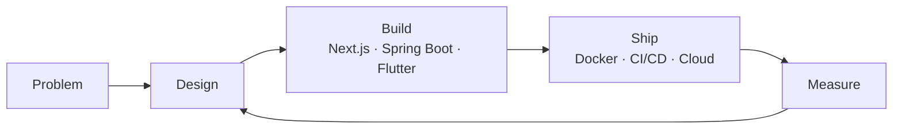

<div align="center">

# Yashvardhan Singh

### Product Engineer &nbsp;|&nbsp; Full Stack & App Dev &nbsp;|&nbsp; AI-Powered Products

*Idea → Prototype → Production*

[LinkedIn](https://www.linkedin.com/in/yashvardhan-singh-data) &nbsp;•&nbsp;
[Email](mailto:yashvardhansingh.professional@gmail.com) &nbsp;•&nbsp;
[Kaggle](https://www.kaggle.com/yashvardhansingh05) &nbsp;•&nbsp;
[GitHub](https://github.com/yashvardhansingh-x5x)

</div>

---

## 👨‍💻 About Me

I'm a **product engineer** who likes owning the whole loop: understanding the problem, designing the system, building a polished interface, shipping it, and iterating on real feedback. I care about products that feel fast, look sharp, and scale cleanly.

```typescript
const yashvardhan = {
  name: "Yashvardhan Singh",
  location: "India 🇮🇳",
  role: "Product Engineer",
  frontend: ["Next.js", "React", "TypeScript", "Tailwind CSS", "GSAP"],
  backend: ["Java", "Spring Boot", "Spring Security", "REST APIs"],
  apps: ["Flutter", "Dart", "Android", "iOS"],
  data: ["PostgreSQL", "pgvector", "MySQL", "MongoDB"],
  ai: ["LLM integrations", "Vector search / RAG", "Python", "TensorFlow", "Scikit-Learn"],
  devops: ["Docker", "Kubernetes", "GitHub Actions", "Jenkins", "AWS", "GCP", "Terraform"],
  principles: ["Ship early", "Obsess over UX", "Measure everything", "Keep learning"],
  funFact: "Too serious about distraction",
};
```

- 🔭 Building **end-to-end products** with Next.js, Spring Boot and AI-powered features
- 🎨 Crafting **motion-rich, responsive interfaces** with Tailwind CSS and GSAP
- 📱 Building **cross-platform mobile apps** with Flutter
- 🔐 Securing backends with **Spring Security** (auth, roles, JWT)
- 🤖 Integrating **AI into real product workflows**, with **PostgreSQL + vector search** behind them
- 🐳 Shipping with **Docker, Kubernetes & CI/CD pipelines**
- ☁️ Exploring **AWS / GCP & Infrastructure as Code**
- 📫 Reach me at **yashvardhansingh.professional@gmail.com**
- ⚡ Fun fact: **Too serious about distraction**

---

## 🛠️ Tech Stack

| | |
|:--|:--|
| **🎨 Frontend** | `Next.js` `React` `TypeScript` `Tailwind CSS` `GSAP` |
| **⚙️ Backend** | `Java` `Spring Boot` `Spring Security` `REST APIs` |
| **📱 App Development** | `Flutter` `Dart` `Android` `iOS` |
| **🗄️ Databases** | `PostgreSQL` `pgvector` `MySQL` `MongoDB` |
| **🧠 AI** | `Python` `TensorFlow` `Scikit-Learn` `Hugging Face` `LangChain` `Jupyter` |
| **🐳 DevOps & Cloud** | `Docker` `Kubernetes` `GitHub Actions` `Jenkins` `AWS` `GCP` `Terraform` `Ansible` `Nginx` `Linux` |
| **🧰 Tools** | `Git` `GitHub` `VS Code` |

---

## 🎯 What I Do

| 🎨 Product Frontend | ⚙️ Backend & Security | 📱 App Development | 🤖 AI & Data | 🐳 Ship & Scale |
|:---:|:---:|:---:|:---:|:---:|
| Next.js apps | Spring Boot services | Flutter cross-platform apps | LLM-powered workflows | Docker & Kubernetes |
| Design-driven UI with Tailwind | Spring Security, JWT & RBAC | Android & iOS from one codebase | PostgreSQL + vector search (RAG) | CI/CD pipelines |
| GSAP animations & micro-interactions | REST API design | State management & API integration | Model integration | AWS / GCP |
| Performance & accessibility | PostgreSQL schema design | Responsive mobile UX | Prompt & pipeline design | Terraform & Ansible |

---

## 📈 Skills Progress

```
Next.js / React      ██████████████░░  85%
Tailwind CSS         ███████████████░  90%
GSAP & Motion        ██████████░░░░░░  65%
Spring Boot          ██████████░░░░░░  65%
Spring Security      █████████░░░░░░░  55%
Flutter / Dart       ██████████░░░░░░  65%
PostgreSQL           ██████████████░░  85%
Vector Search / RAG  █████████░░░░░░░  55%
AI Integration       ██████████░░░░░░  65%
Docker & K8s         ██████████░░░░░░  65%
CI/CD Pipelines      ██████████░░░░░░  65%
Cloud (AWS/GCP)      █████████░░░░░░░  55%
Terraform/Ansible    ████████░░░░░░░░  50%
```

---

## 🔄 How I Build



> *"Make it work, make it right, make it fast — then ship it."*

---

## 🤝 Connect With Me

- 💼 **LinkedIn:** [yashvardhan-singh-data](https://www.linkedin.com/in/yashvardhan-singh-data)
- ✉️ **Email:** [yashvardhansingh.professional@gmail.com](mailto:yashvardhansingh.professional@gmail.com)
- 📊 **Kaggle:** [yashvardhansingh05](https://www.kaggle.com/yashvardhansingh05)
- 🐙 **GitHub:** [yashvardhansingh-x5x](https://github.com/yashvardhansingh-x5x)

---

<div align="center">

**Build it. Ship it. Scale it.** 🚀

Thanks for visiting! — [Yashvardhan Singh](https://github.com/yashvardhansingh-x5x)

</div>
